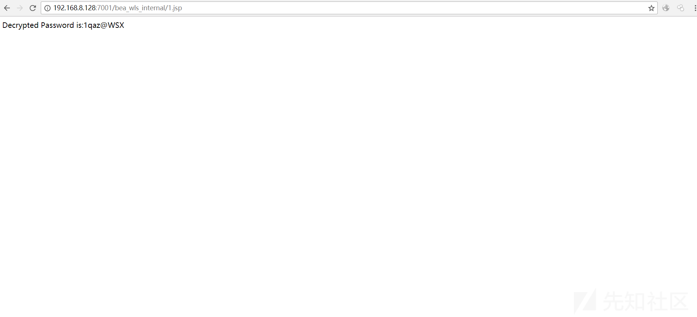

# WebLogicPasswordDecryptorUi
weblogic解密JAVA UI版,欢迎提交BUG。如果遇到密文倒数第二位有斜杠的话，请先删除斜杠再尝试解密。否则可能解密失败


## WeblogicPassword 在线解密(转)

>  原文：https://xz.aliyun.com/t/2149

如有webshell可进行在线解密
把```weblogicdecryptor.jsp```放入服务器进行访问，s="" 中填写 weblogic 的加密密码，可在 boot.properties 文件中找到。默认路径为```../../../Server/security/boot.properties```



## 法律
> 该项目仅供合法的渗透测试以及爱好者参考学习，请各位遵守《中华人民共和国网络安全法》以及相应地方的法律，禁止使用该项目进行违法操作，否则自行承担相关责任！
